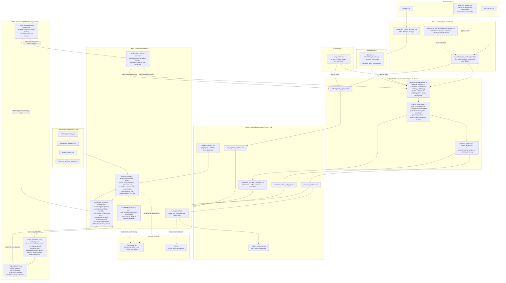

# Control Tower — Architecture

Two diagrams: the system as a whole, and the detection/diagnosis pipeline in
detail. Both are defined as Mermaid source (renders natively on GitHub and
in most markdown viewers) and exported as standalone PNG files in
[docs/diagrams/](diagrams/) for anyone who needs a plain image file:
[system_overview.png](diagrams/system_overview.png) and
[pipeline_dataflow.png](diagrams/pipeline_dataflow.png). Regenerate them
after editing the Mermaid source with:

```bash
npx -p @mermaid-js/mermaid-cli mmdc -i docs/diagrams/system_overview.mmd -o docs/diagrams/system_overview.png -b white -s 6
npx -p @mermaid-js/mermaid-cli mmdc -i docs/diagrams/pipeline_dataflow.mmd -o docs/diagrams/pipeline_dataflow.png -b white -s 6
```

## 1. System overview



## 2. Detection & diagnosis pipeline (data flow)

```mermaid
flowchart LR
    LIVE["transactions_live_multisegment.csv"] --> DA["detection_aggregator.py"]
    DA -->|"detection_windows.csv<br/>(6 detection levels)"| AW["adaptive_windows.py"]
    AW -->|"adaptive_detection_windows.csv<br/>(1-min, falls back to 5-min)"| AS["anomaly_scanner.py"]
    AS -->|"anomaly_candidates.csv<br/>z >= 2, drop >= 5pp, n >= 30"| AV["anomaly_validator.py"]
    AV -->|"validated_anomalies.csv<br/>FDR + 2 consecutive minutes"| IC["incident_clusterer.py"]
    IC -->|"clustered_incidents.csv<br/>temporal clusters, gap <= 2 min"| RCE["root_cause_engine.py"]
    RCE -->|"root_cause_incidents.csv<br/>provider / bank / merchant / method / decline_code"| CONS["incident_consolidator.py"]
    CONS -->|"consolidated_incidents.csv<br/>confidence >= 0.70 to be a primary incident"| FI["financial_impact.py"]
    CONS -.->|"confidence < 0.70"| UNRES["unresolved_incident_candidates.csv"]
    FI -->|"incidents_with_financial_impact.csv"| PE["priority_engine.py"]
    PE -->|"prioritized_incidents.csv (P1-P4)"| RE["recommendation_engine.py"]
    RE -->|"incidents_with_recommendations.csv"| HR["human_review.py"]
    HR -->|"reviewed_incidents.csv"| API["src/api.py"]
    UNRES --> API
```



## Reading the diagrams

- **Two independent branches feed `data/`**: the statistical detection chain
  (top-left of diagram 1, detailed in diagram 2) and
  `multisegment_aggregator.py`, which only produces `live_segment_windows.csv`
  for `/dashboard`'s network-wide metrics. `run_pipeline.py` runs both.
- **`incident_consolidator.py` is the only gate** between a statistically
  validated anomaly and a real incident: `confidence_score >= 0.70` and a
  root cause in `{provider, issuing_bank, decline_code}`. Everything else
  lands in `unresolved_incident_candidates.csv` and is shown honestly as
  "not enough evidence," never forced into a diagnosis.
- **The API never trusts a cache**: every endpoint re-reads the relevant
  CSVs on each request, so a pipeline re-run (manual, or via the trial-by-fire
  flow) is visible on the dashboard's next 20-second poll with no restart.
- **OpenAI and ntfy are optional, isolated dependencies.** Without
  `OPENAI_API_KEY` the analysis endpoint returns a clean 503; without
  `NTFY_TOPIC` the notification loop simply never fires. Neither failure
  touches detection, diagnosis, or the rest of the API.
- **`data/generated/incident_memory.csv` and `data/generated/notified_incidents.json`** are
  runtime state written by the running API, not source data — gitignored,
  regenerated on first use.
- **`data/` splits into `source/` (never rewritten by the pipeline) and
  `generated/` (everything `run_pipeline.py` writes)** - every stage's
  `INPUT_PATH`/`OUTPUT_PATH` points at one or the other, never a bare
  `data/`.
- **Ask PRISM and Trial by fire both run entirely from the browser, no
  terminal.** Ask PRISM's tools call the exact same enrichment functions
  the REST endpoints use, so it can't answer with anything the dashboard
  itself couldn't show. Trial by fire's inject and reset actions share one
  `threading.Lock`, so two people using either at the same time get an
  immediate, honest 409 instead of racing on the same files.
